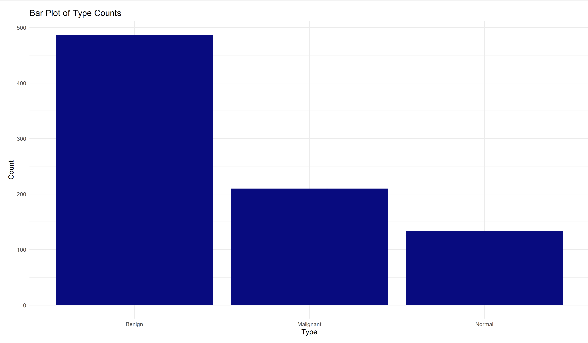

# Group 1 - Project 2, Classifying Breast Cancer Ultrasound Images

## Table of Contents
- SRC:
  - This folder contains all of the source code for our project. This folder contains all code used to load and combine the image data as well as structure the final model for training.
- DATA:
  - This folder is where we store all datasets being used for this project. Specifically it has three subfolders that contain all image data for the respective kind of tumor that the image displays (benign, malignant, or normal). Within each of these folders, the images are further divided into two folders titled "full" or "masked" based on the image type.
- Figures:
  -  This folder contains exploratory plots looking into the distribution of data between the three types of tumors. As we move forward with our analysis, we will include figures as they relate to the final model.

## SRC
### Installing/ Building our code
### Notebook Files
| Notebook Name | Decription |
| -------- | -------- |
| transfer_learning.ipynb | This notebook cleans the raw data and combines the images into a dataset that will be used for model training|
| P2-Visualizations.rmd | This notebook cleans code for creating visualizations to view the general distribution of the data |
### Usage

## DATA
### Dataset Dictionary
| Column Name | Definition | 
| -------- | -------- |
| Image | Breast Ultrasound Image file (json format)|
| Classification | Type of tumor (benign, malignant, or normal)|

## Figures
| Figure | Takeaways | 
| -------- | -------- |
|   | This plot was used during the exploratory phase of the project. It provided a way to visualize the spread of the data across the three possible types of ultrasound images. From this plot we were able to see that benign had the most image data while normal has by far the least. |
|   | This plot shows |

## References
[1] W. Al-Dhabyani, M. Gomaa, H. Khaled, and A. Fahmy, "Dataset of breast ultrasound images," Data in Brief, vol. 28, p. 104863, 2020. [Online]. Available: https://doi.org/10.1016/j.dib.2019.104863.

[2] G. Ayana, K. Dese, and S. Choe, "Transfer Learning in Breast Cancer Diagnoses via Ultrasound Imaging," Cancers, vol. 13, no. 4, p. 738, 2021. [Online]. Available: https://doi.org/10.3390/cancers13040738.

[3] F. Chollet, "Data Preprocessing," TensorFlow, 2017. [Online]. Available: https://www.tensorflow.org/tutorials/images/transfer_learning#data_preprocessing. 

### Previous Work
- MI-1: https://docs.google.com/document/d/1OsSMSBwFDf6P__UTcfK3AbjcKovTtPvrOny9YICQMQQ/edit?usp=sharing
- MI-2: https://docs.google.com/document/d/1eoXdahQBwyJ3K_WUYtUmqAdbdpWteN16fUMx278WaoQ/edit?usp=sharing

### Acknowledgements
We would like to thank Professor Alonzi and Harsh Anand for supporting us throughout this project. We greatly appreciate all of the feedback and guidance they have provided and owe part of our success in completing this assignment to them!
